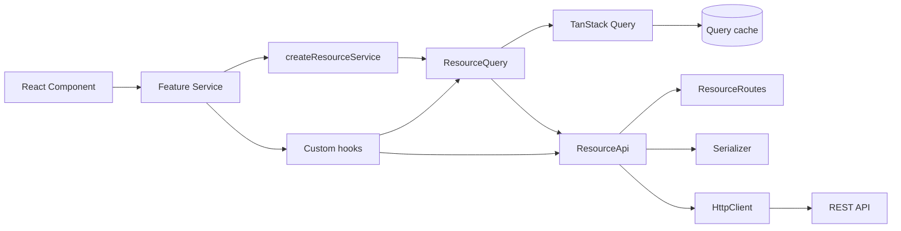
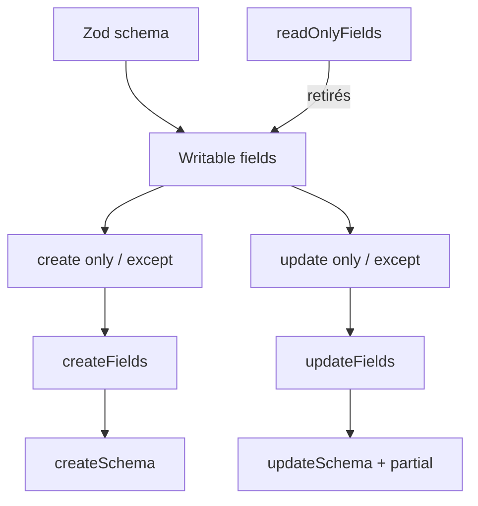
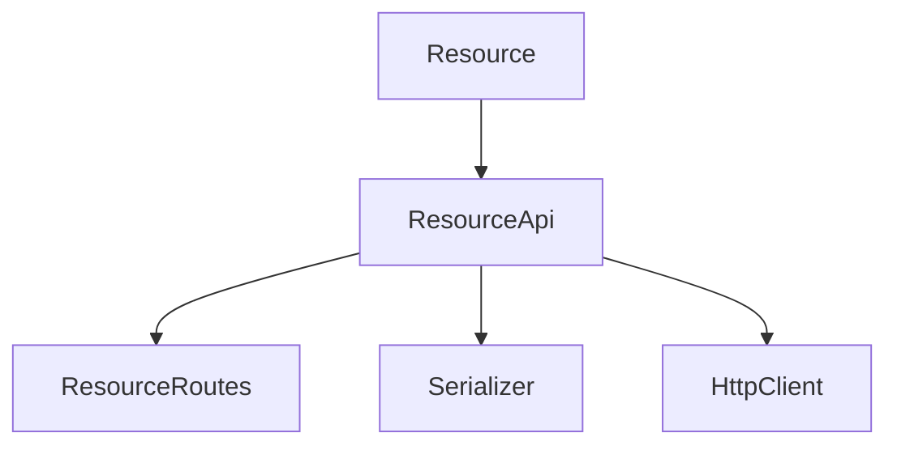
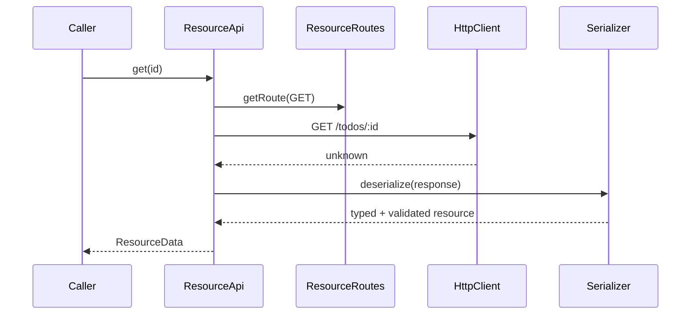
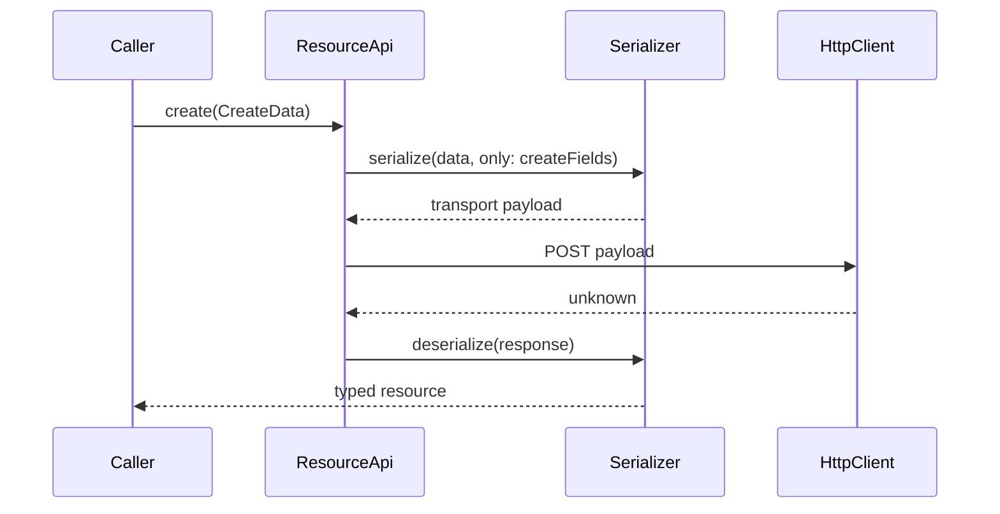

# front-template

Template interne React/TypeScript conçu pour accélérer le développement d'applications en factorisant les conventions répétitives autour des ressources, du typage, de la validation, de la sérialisation et des appels HTTP.

> **Principe directeur :** définir peu, dériver beaucoup, rester extensible.

L'objectif n'est pas de recréer un framework généraliste, mais de fournir une base cohérente dans laquelle une ressource métier définie une fois peut alimenter automatiquement une grande partie de la couche data du front.

## État du projet

La chaîne `Resource → ResourceRoutes → Serializer → ResourceApi → HttpClient` est en place et testée. La configuration, les settings, le bootstrap et les utilitaires de base sont également disponibles.

La gestion structurée des erreurs est également en place. Le core distingue désormais les erreurs de configuration, de settings, de transport réseau, de réponse HTTP, de parsing de réponse et de sérialisation, tout en conservant l'erreur d'origine via `cause` lorsqu'elle est connue.

La journalisation structurée est également intégrée. Le core expose un contrat `Logger` indépendant de l'implémentation concrète, avec une implémentation basée sur Pino. Le niveau de log est configurable par environnement et `HttpClient` journalise les requêtes HTTP en `debug` avec leur méthode, URL, statut et durée.

**TanStack Query est intégré** via `ResourceQuery`. Les lectures `getAll` / `get`, les mutations `create` / `update` / `delete`, les query keys, la propagation de `AbortSignal` et les règles d’invalidation du cache ont été validées contre l’API Laravel de référence et couvertes par des tests.

La couche **Service est en place** via `createResourceService()`. Elle constitue la façade React générique d’une feature : les composants utilisent par exemple `todoService.useGetAll()`, `useGet()`, `useCreate()`, `useUpdate()` et `useDelete()` sans importer directement TanStack Query, `ResourceQuery` ou `ResourceApi`.

`createResourceService()` reçoit explicitement un `ResourceQuery`. Une même instance de `ResourceQuery` peut ainsi être partagée entre le CRUD générique et les opérations métier spécifiques d’une feature.

Une seconde feature de référence, **Note**, valide cette extensibilité avec l’opération métier `togglePinned`. `noteService.useTogglePinned()` appelle une méthode spécifique de `NoteApi`, puis réutilise la politique d’invalidation de `ResourceQuery` afin de rafraîchir la liste et le détail concernés.

Le typage dérivé de la `Resource` reste conservé à travers toute la chaîne jusqu’aux variables des mutations.

La `Resource` dérive désormais également ses contrats de validation d'écriture : `createSchema` et `updateSchema` sont construits automatiquement à partir du schéma principal, des champs readonly et des règles `only` / `except`. Les types `CreateData` / `UpdateData` et les schémas Zod runtime restent ainsi alignés à partir de la même définition.



## Stack

- React 19
- TypeScript 6
- Vite 8
- Zod pour les schémas et la validation runtime
- TanStack Query pour le server state et le cache
- Vitest + Testing Library pour les tests
- date-fns pour les dates
- deepmerge-ts pour les settings
- Pino pour l'implémentation actuelle du logging
- ESLint + Prettier
- Husky + lint-staged + commitlint
- Node.js 24 minimum (`.nvmrc` = `24`)

## Structure

```text
src/
├── components/
│   └── ui/
├── core/
│   ├── api/
│   │   ├── HttpClient.ts
│   │   ├── ResourceApi.ts
│   │   └── ResourceId.ts
│   ├── bootstrap/
│   │   └── bootstrapApplication.ts
│   ├── config/
│   ├── error/
│   │   ├── AppError.ts
│   │   ├── ApiError.ts
│   │   ├── ConfigurationError.ts
│   │   ├── NetworkError.ts
│   │   ├── ResponseParseError.ts
│   │   ├── SerializationError.ts
│   │   └── SettingsError.ts
│   ├── logger/
│   │   ├── Logger.ts
│   │   ├── LogLevel.ts
│   │   ├── PinoLogger.ts
│   │   └── loggerRegistry.ts
│   ├── query/
│   │   └── ResourceQuery.ts
│   ├── resource/
│   │   ├── FieldSelection.ts
│   │   ├── Resource.ts
│   │   ├── ResourceData.ts
│   │   └── ResourceFields.ts
│   ├── route/
│   │   ├── HttpMethod.ts
│   │   ├── ResourceRoute.ts
│   │   ├── ResourceRouteName.ts
│   │   └── Route.ts
│   ├── schema/
│   │   └── SchemaUtils.ts
│   ├── serializer/
│   │   └── Serializer.ts
│   ├── service/
│   │   └── ResourceService.ts
│   ├── settings/
│   └── utils/
├── features/
│   ├── note/
│   └── todo/
└── test/
    └── setup.ts
```

`core/` contient les briques génériques du template. `features/` contient les éléments propres aux domaines métier. `components/ui/` contient les primitives UI partagées. Les tests sont principalement colocalisés avec le code ; `src/test/` sert à l'infrastructure de test partagée.

---

# Architecture des ressources

## `Resource`

`Resource` est la source de vérité d'une ressource côté front. Elle associe un nom, un schéma Zod et les règles indiquant quels champs peuvent être écrits lors d'un create ou d'un update.

Exemple :

```ts
export const todoSchema = z.object({
  id: z.number(),
  title: z.string().min(1),
  description: z.string().nullable(),
  completed: z.boolean(),
  created_at: z.coerce.date(),
  updated_at: z.coerce.date(),
})

export const todoResource = new Resource('todo', todoSchema, {
  readOnlyFields: ['id', 'created_at', 'updated_at'],
  create: {
    except: ['completed'],
  },
})
```

Cela donne conceptuellement :



Pour ce `Todo` :

```text
schema fields  = id, title, description, completed, created_at, updated_at
readOnlyFields = id, created_at, updated_at
writableFields = title, description, completed
createFields   = title, description
updateFields   = title, description, completed
```

Par défaut, tous les champs non readonly sont disponibles en create et en update.

### `only` / `except`

La sélection est représentée par `FieldSelection<TField>`. `only` et `except` sont mutuellement exclusifs au niveau TypeScript.

```ts
create: {
  only: ['title', 'description'],
}
```

ou :

```ts
create: {
  except: ['completed'],
}
```

Un champ déclaré readonly ne peut pas être réintroduit via `only`. La `Resource` vérifie également ces incohérences au runtime.

## Schémas dérivés : `createSchema` et `updateSchema`

La `Resource` dérive désormais deux schémas Zod d'écriture à partir du schéma principal et des règles de sélection :

```ts
todoResource.schema
todoResource.createSchema
todoResource.updateSchema
```

Pour l'exemple précédent :

```text
schema
├── id
├── title
├── description
├── completed
├── created_at
└── updated_at

createSchema
├── title
└── description

updateSchema
├── title?
├── description?
└── completed?
```

`createSchema` reprend les validateurs Zod des champs sélectionnés pour la création. Les champs readonly et les champs exclus du create n'en font pas partie.

`updateSchema` reprend de la même manière les champs sélectionnés pour l'update, puis applique une sémantique `partial` adaptée au PATCH : chaque champ est optionnel, mais lorsqu'un champ est présent ses contraintes Zod d'origine restent appliquées.

Ces schémas permettent notamment à une future couche de formulaire de réutiliser directement le contrat de validation déjà défini par la `Resource`, sans reconstruire manuellement un second schéma UI.

## Typage dérivé : `CreateData` et `UpdateData`

`ResourceData.ts` dérive les payloads TypeScript directement de la `Resource` et de ses options. Il n'est donc pas nécessaire de maintenir manuellement des interfaces `CreateTodo`, `UpdateTodo`, etc.

Pour le Todo ci-dessus :

```ts
type CreateTodo = CreateData<typeof todoResource>
// {
//   title: string
//   description: string | null
// }

type UpdateTodo = UpdateData<typeof todoResource>
// {
//   title?: string
//   description?: string | null
//   completed?: boolean
// }
```

`UpdateData` est volontairement `Partial` : les updates utilisent actuellement PATCH.

La propriété phantom `$options` de `Resource` existe uniquement au niveau du système de types afin de conserver le type littéral exact des options passées au constructeur. Elle n'est pas une donnée runtime à utiliser dans le code applicatif.

### Alignement compile-time / runtime

Le contrat d'écriture est dérivé sur deux axes à partir de la même `Resource` :

```text
Resource
├── compile-time
│   ├── CreateData<Resource>
│   └── UpdateData<Resource>
└── runtime
    ├── createSchema
    └── updateSchema
```

Les tests de types vérifient que les données inférées depuis `createSchema` / `updateSchema` correspondent aux types `CreateData` / `UpdateData`.

Le template distingue donc volontairement :

1. **TypeScript / compile-time** : l'API haut niveau empêche les appels incorrects pendant le développement ;
2. **Zod / runtime** : les données réellement reçues, saisies ou sérialisées sont validées à l'exécution.

Par exemple, `ResourceApi.create()` exige un `CreateData<...>`, tandis que la validation runtime peut s'appuyer sur `createSchema`.

## `ResourceFields`

`ResourceFields.ts` centralise le calcul type-level des champs disponibles en create et en update.

Il applique successivement :

```text
champs du schema
    ↓
retrait des readOnlyFields
    ↓
application de only / except
    ↓
CreateFields / UpdateFields
```

Cette logique est séparée de `ResourceData.ts` : `ResourceFields` détermine les clés, tandis que `ResourceData` transforme ces clés en types de payload.

---

# Utilitaires de schéma

## `SchemaUtils.pick()`

`SchemaUtils.pick()` construit un nouveau `ZodObject` à partir d'un schéma et d'une liste typée de champs :

```ts
const schema = SchemaUtils.pick(todoResource.schema, ['title', 'description'])
```

Son type de retour conserve les clés sélectionnées :

```ts
ZodObject<Pick<TShape, TKey>>
```

Cette primitive évite de reconstruire manuellement des shapes Zod à plusieurs endroits du core. Elle est utilisée pour dériver les schémas d'écriture de `Resource` et par le `Serializer` lorsqu'il doit sérialiser une sélection de champs.

Le helper reste volontairement minimal : aucun `omit()` générique n'est ajouté tant qu'un besoin récurrent ne le justifie.

---

# Routes

## `ResourceRoutes`

`ResourceRoutes` génère les routes CRUD conventionnelles à partir du nom de la Resource.

Pour `new Resource('todo', ...)` :

| Opération | Méthode | URL          |
| --------- | ------- | ------------ |
| `getAll`  | GET     | `/todos`     |
| `get`     | GET     | `/todos/:id` |
| `create`  | POST    | `/todos`     |
| `update`  | PATCH   | `/todos/:id` |
| `delete`  | DELETE  | `/todos/:id` |

Une `baseUrl` spécifique à la ressource peut être injectée au constructeur. Cette URL représente le **chemin de ressource**, pas l'origine de l'API : l'origine (`http://...`) appartient à `HttpClient`.

La pluralisation est volontairement simple pour le moment : `${resource.name}s`.

Les noms de routes et méthodes HTTP sont centralisés dans `RESOURCE_ROUTE` et `HTTP_METHOD` afin d'éviter les chaînes dispersées.

---

# Sérialisation

## `Serializer`

`Serializer` assure la frontière entre les objets métier validés par Zod et les payloads JS transportables.

Responsabilités actuelles :

- `deserialize(data)` : valide une ressource avec Zod ;
- `deserializeMany(data)` : valide un tableau de ressources ;
- `serialize(data)` : valide puis transforme les valeurs transportables ;
- transforme les `ZodError` comprises à cette frontière en `SerializationError`, avec `operation` (`serialize` / `deserialize`), nom de ressource et `cause` ;
- sélection de champs avec `only` / `except` ;
- sérialisation partielle avec `partial` ;
- conversion récursive des `Date` en ISO, y compris dans les objets imbriqués et tableaux.

Pour les sélections de champs, le Serializer réutilise `SchemaUtils.pick()` au lieu de reconstruire lui-même un `ZodObject`.

Exemple :

```ts
serializer.serialize(
  { completed: true },
  {
    only: ['title', 'completed'],
    partial: true,
  },
)
```

`partial` est indépendant de `only` / `except` : la sélection indique **quels champs sont autorisés**, tandis que `partial` indique **si tous les champs sélectionnés sont requis**.

C'est essentiel pour PATCH :

```text
updateFields = title, description, completed
payload      = { completed: true }
partial      = true
              ↓
le payload est valide sans exiger title et description
```

Le Serializer ne connaît volontairement ni HTTP, ni create/update, ni TanStack Query.

Une donnée JSON syntaxiquement valide mais incompatible avec le schéma de la `Resource` produit une `SerializationError`. Pour `deserializeMany()`, le chemin Zod conservé dans `cause` permet notamment d'identifier l'index et le champ invalides.

---

# HTTP

## `HttpClient`

`HttpClient` est volontairement une couche de transport simple. Il ne connaît ni les Resources ni Zod.

Il fournit actuellement :

```ts
get(url, options)
post(url, body, options)
put(url, body, options)
patch(url, body, options)
delete (url, options)
```

Comportements actuels :

- base URL provenant de `env('API_URL')` par défaut ;
- base URL injectable, notamment pour les tests ;
- JSON stringify automatique pour les bodies ;
- `Content-Type: application/json` lorsqu'un body est présent ;
- headers personnalisés ;
- `AbortSignal` ;
- `ApiError` pour une réponse HTTP non `ok`, avec statut, méthode, URL et body de réponse lorsqu'il est lisible ;
- `NetworkError` lorsqu'un échec réseau de `fetch()` est identifié ;
- conservation de `AbortError` afin que les annulations restent distinctes des erreurs réseau ;
- `ResponseParseError` lorsqu'une réponse annoncée JSON ne peut pas être parsée ;
- propagation intacte des erreurs inattendues ;
- `204` → `undefined` ;
- réponse non JSON → `undefined` ;
- réponse JSON valide → `unknown`.

Le retour `unknown` est intentionnel : `HttpClient` transporte des données ; la validation métier appartient à la couche supérieure.

`AbortSignal` permet à TanStack Query de propager son signal d'annulation jusqu'à `fetch`. Une annulation n'est pas requalifiée en `NetworkError` : l'`AbortError` d'origine remonte intacte.

---

# `ResourceApi`

`ResourceApi` assemble les briques précédentes pour fournir une API CRUD générique, typée et validée.



API publique :

```ts
getAll(options?)
get(id, options?)
create(data, options?)
update(id, data, options?)
delete(id, options?)
```

`ResourceId` accepte actuellement `string | number`. Les IDs insérés dans les URLs sont passés par `encodeURIComponent`.

Les dépendances `ResourceRoutes`, `Serializer` et `HttpClient` peuvent être injectées dans le constructeur. L'utilisation normale reste simple :

```ts
const api = new ResourceApi(todoResource)
```

mais les tests peuvent par exemple injecter un `HttpClient` contrôlé.

## Flux GET



## Flux GET ALL

```text
ResourceApi.getAll()
    ↓
ResourceRoutes.getRoute(GET_ALL)
    ↓
HttpClient.get()
    ↓ unknown
Serializer.deserializeMany()
    ↓
ResourceData[]
```

## Flux CREATE



Le compile-time empêche déjà d'envoyer des champs qui ne font pas partie de `CreateData`; la sélection runtime `createFields` constitue en plus le contrat de sérialisation. `createSchema` expose ce même contrat sous forme de schéma Zod réutilisable.

## Flux UPDATE

```text
ResourceApi.update(id, UpdateData)
    ↓
Serializer.serialize(
    data,
    only: updateFields,
    partial: true,
)
    ↓
HttpClient.patch()
    ↓ unknown
Serializer.deserialize()
    ↓
ResourceData
```

Le `partial: true` est important : `UpdateData` autorise un PATCH avec un seul champ. `updateSchema` représente également ce contrat sous forme de schéma Zod partiel.

## Flux DELETE

```text
ResourceApi.delete(id)
    ↓
ResourceRoutes → DELETE /resource/:id
    ↓
HttpClient.delete()
    ↓
void
```

---

# Configuration et settings

Le projet distingue deux concepts.

## Config : dépendante de l'environnement

`core/config` gère les valeurs qui changent selon l'environnement d'exécution.

Le schéma actuel contient notamment :

```ts
API_URL: z.url()
LOG_LEVEL: logLevelSchema
API_BACKEND = generic | laravel
```

Les niveaux de log supportés sont :

```text
trace | debug | info | warn | error | fatal | silent
```

Dans Vite, les variables correspondantes sont par exemple :

```dotenv
VITE_API_URL=http://localhost:3000
VITE_LOG_LEVEL=debug
API_BACKEND=generic
```

`LOG_LEVEL` contrôle le niveau minimal transmis par le logger. `silent` permet de désactiver complètement la journalisation.

`parseConfig()` :

1. conserve les variables préfixées `VITE_` ;
2. retire ce préfixe ;
3. valide le résultat avec un schéma Zod strict ;
4. transforme une erreur de validation Zod en `ConfigurationError` lisible, en conservant la `ZodError` dans `cause`.

`initializeConfig()` doit être appelé avant `env()`.

## Settings : conventions applicatives

`core/settings` contient les conventions versionnées avec l'application et non les valeurs propres à un environnement.

Valeurs actuelles :

```ts
date: {
  format: 'dd/MM/yyyy',
  dateTimeFormat: 'dd/MM/yyyy HH:mm',
}
```

Les overrides sont validés puis fusionnés profondément avec les valeurs par défaut via `deepmerge-ts`. Une configuration de settings invalide produit une `SettingsError` dont `cause` conserve la `ZodError` d'origine.

## Bootstrap

`bootstrapApplication()` initialise les dépendances globales du core dans l'ordre nécessaire :

```text
bootstrapApplication()
    ├── initializeConfig()
    ├── initializeLogger()
    └── initializeSettings()
```

La configuration est initialisée avant le logger afin que celui-ci puisse utiliser le niveau défini par `LOG_LEVEL`.

Le bootstrap est appelé dans `main.tsx` **avant le render React** afin que les services qui dépendent de ces éléments puissent ensuite être utilisés en sécurité.

---

# Gestion des erreurs

Le core possède une hiérarchie d'erreurs structurées basée sur `AppError`. L'objectif n'est pas de convertir toutes les exceptions en erreurs custom, mais de typer uniquement les erreurs dont la couche courante comprend réellement la signification.

```text
AppError
├── ConfigurationError
│   └── variables d'environnement / config invalides
├── SettingsError
│   └── settings applicatifs invalides
├── NetworkError
│   └── échec réseau identifié lors de fetch()
├── ApiError
│   └── réponse HTTP non successful
├── ResponseParseError
│   └── réponse annoncée JSON mais JSON illisible
└── SerializationError
    └── données incompatibles avec le schéma d'une Resource
        ├── serialize
        └── deserialize
```

Chaque erreur expose un `kind` discriminant. Les erreurs qui possèdent un contexte supplémentaire conservent également les informations utiles à leur frontière : `status`, `statusText`, `method`, `url`, `data`, `resource` ou `operation` selon le cas.

Lorsqu'une erreur technique connue est transformée, l'erreur d'origine est conservée dans `cause`.

```text
ZodError dans parseConfig()
    → ConfigurationError
        cause = ZodError

ZodError dans initializeSettings()
    → SettingsError
        cause = ZodError

TypeError réseau dans fetch()
    → NetworkError
        cause = TypeError

SyntaxError dans response.json()
    → ResponseParseError
        cause = SyntaxError

ZodError dans Serializer
    → SerializationError
        cause = ZodError
```

La règle générale est volontairement conservatrice :

> **erreur comprise par la couche → erreur applicative typée ; erreur inattendue → propagation intacte.**

Ainsi, une annulation `AbortError` n'est pas transformée en `NetworkError`, et une erreur inattendue pendant le parsing ou la sérialisation n'est pas artificiellement requalifiée.

## Frontières HTTP et sérialisation

```text
fetch() échoue au niveau réseau
    → NetworkError

serveur répond 404 / 422 / 500
    → ApiError

serveur répond 200 + Content-Type JSON + JSON malformé
    → ResponseParseError

serveur répond un JSON valide mais incompatible avec la Resource
    → SerializationError
```

`ApiError.data` reste volontairement `unknown`. `HttpClient` ne connaît pas les conventions d'un backend particulier, notamment la structure des erreurs de validation Laravel. Une interprétation métier éventuelle doit rester dans une couche supérieure.

---

# Logging

Le core fournit une abstraction légère de journalisation afin que le code applicatif ne dépende pas directement d'une librairie de logging.

```text
HttpClient ──→ Logger ←── PinoLogger ──→ Pino
```

## `Logger` et `PinoLogger`

`Logger` constitue le contrat utilisé par le reste du core. `PinoLogger` est son implémentation concrète actuelle. Pino reste ainsi un détail d'infrastructure : les consommateurs dépendent du contrat `Logger`, pas directement de la librairie.

Cette séparation permet de remplacer l'implémentation sans modifier les consommateurs et d'injecter facilement un logger contrôlé dans les tests.

## Logger global et injection

Le logger applicatif est enregistré lors du bootstrap et peut être récupéré via le registry du core. Les classes qui en ont besoin peuvent néanmoins accepter explicitement un `Logger`, notamment `HttpClient`.

```text
new HttpClient()
    → getLogger()
    → logger applicatif

new HttpClient({ logger })
    → logger injecté
```

L'injection est particulièrement utile pour les tests sans imposer la création manuelle du logger dans l'utilisation normale.

## Logging HTTP

`HttpClient` journalise actuellement le cycle d'une requête au niveau `debug`.

```text
HTTP request started
    method
    url

HTTP request completed
    method
    url
    status
    durationMs
```

Une réponse HTTP non successful est elle aussi une requête terminée : son statut est journalisé avant que `HttpClient` ne produise un `ApiError`.

Les erreurs ne sont volontairement pas journalisées automatiquement avec `logger.error()` dans `HttpClient`. La couche HTTP qualifie et propage les erreurs qu'elle comprend ; le choix du niveau auquel une erreur doit être journalisée reste séparé afin d'éviter les logs dupliqués dans les couches supérieures.

Les bodies et headers ne sont pas journalisés automatiquement afin de limiter le bruit et le risque d'exposer des données sensibles.

## Niveau de log

Le niveau est fourni par la configuration d'environnement :

```dotenv
VITE_LOG_LEVEL=debug
```

Valeurs supportées : `trace`, `debug`, `info`, `warn`, `error`, `fatal`, `silent`.

---

# Utilitaires

## `DateUtils`

Classe statique utilisant `date-fns` et les settings :

- `DateUtils.format()`
- `DateUtils.formatDateTime()`
- `DateUtils.parse()`
- `DateUtils.toIso()`

Le Serializer utilise `DateUtils.toIso()` pour convertir les dates avant transport.

## `StringUtils`

Utilitaires statiques :

- `capitalize()`
- `toCamelCase()`
- `toSnakeCase()`
- `normalize()`

---

# Environnement de développement

## Installation

Le projet requiert Node.js 24 ou supérieur.

Avec nvm :

```bash
nvm use
npm install
```

Créer ensuite le fichier d'environnement local à partir de l'exemple :

```bash
cp .env.example .env
```

Puis adapter `VITE_API_URL` au backend utilisé et `VITE_LOG_LEVEL` au niveau de journalisation souhaité.

Démarrage :

```bash
npm run dev
```

## Scripts npm

| Commande               | Rôle                          |
| ---------------------- | ----------------------------- |
| `npm run dev`          | serveur Vite de développement |
| `npm run build`        | typecheck puis build Vite     |
| `npm run preview`      | preview du build              |
| `npm run typecheck`    | TypeScript sans émission      |
| `npm run test`         | tests Vitest en mode run      |
| `npm run test:watch`   | Vitest en mode watch          |
| `npm run lint`         | ESLint                        |
| `npm run format`       | applique Prettier             |
| `npm run format:check` | vérifie le formatage          |

Avant de considérer un bloc de travail terminé :

```bash
npm run typecheck
npm test
npm run lint
```

## Alias `@`

`@/` pointe vers `src/`.

```ts
import { Resource } from '@/core/resource/Resource'
```

L'alias est configuré côté Vite et TypeScript.

## Formatage

Prettier :

```json
{
  "semi": false,
  "singleQuote": true,
  "trailingComma": "all",
  "tabWidth": 2,
  "printWidth": 100
}
```

`.editorconfig` impose notamment UTF-8, LF, indentation de deux espaces et newline finale.

## Git hooks

Les hooks sont gérés par Husky.

### pre-commit

```bash
npx lint-staged
```

`lint-staged` applique ESLint/Prettier uniquement aux fichiers staged.

### commit-msg

```bash
npx --no -- commitlint --edit "$1"
```

Les messages suivent **Conventional Commits** via `@commitlint/config-conventional`.

Exemples :

```text
feat(api): add resource API
feat(resource): derive create and update schemas
feat(serializer): support partial serialization
refactor(route): preserve resource option types
fix(config): handle invalid API URL
chore(tooling): configure commitlint
test(resource): cover readonly fields
```

Types usuels : `feat`, `fix`, `refactor`, `perf`, `test`, `docs`, `chore`, `ci`.

### pre-push

```bash
npm run typecheck
npm run test
```

Un push est donc bloqué si TypeScript ou les tests échouent. Le build complet n'est volontairement pas exécuté dans ce hook.

---

# Tests

Vitest utilise `jsdom`, avec Testing Library disponible pour les tests React.

## Philosophie

Les tests doivent protéger les **contrats** plutôt que reproduire l'implémentation.

Exemples actuels :

- `Resource.test.ts` : comportement runtime des champs readonly/create/update ;
- `Resource.types.test.ts` : contrat compile-time de `CreateData` / `UpdateData`, ainsi que l'alignement avec `createSchema` / `updateSchema` ;
- `SchemaUtils.types.test.ts` : conservation du typage des champs sélectionnés par `SchemaUtils.pick()` ;
- `Serializer.test.ts` : validation, sélection, partial, dates, tableaux et contrat de `SerializationError` ;
- `HttpClient.test.ts` : transport HTTP, logging des requêtes, `ApiError`, `NetworkError`, `ResponseParseError`, préservation des annulations et propagation des erreurs inattendues ;
- `ResourceApi.test.ts` : orchestration CRUD avec vraies routes et vrai Serializer, en contrôlant uniquement le transport ;
- `ResourceQuery.test.ts` : query keys, délégation des reads/mutations, politique d’invalidation du cache et contrat de `invalidateResource()` ;
- `ResourceService.test.tsx` : intégration React/TanStack de la façade CRUD ;
- `ResourceService.types.test.ts` : conservation de l’inférence des payloads create/update à travers la factory ;
- `NoteApi.test.ts` : contrat de l’opération métier `togglePinned`, endpoint spécifique, encodage de l’ID et désérialisation de la réponse ;
- `note.service.test.tsx` : intégration React de `useTogglePinned()` et réutilisation de la politique d’invalidation de `ResourceQuery` ;
- tests dédiés pour config, settings et utils, notamment les contrats `ConfigurationError` et `SettingsError`.

Éviter de retester dans une feature un comportement générique déjà garanti par `core`, sauf si la feature possède un contrat spécifique à protéger.

Pour `ResourceApi`, on privilégie l'observation du comportement final plutôt que des spies sur les détails internes du Serializer : payload HTTP produit, réponse désérialisée, propagation des options, validation des réponses, etc.

---

# Frontières de responsabilité

Une règle importante du projet est de ne pas faire remonter les responsabilités d'une couche dans une autre.

```text
Resource
  définition du contrat métier, des champs et des schémas d'écriture dérivés

SchemaUtils
  primitives génériques de manipulation de schémas Zod

ResourceRoutes
  convention des endpoints CRUD

Serializer
  validation et transformation des données

HttpClient
  transport HTTP générique

ResourceApi
  orchestration CRUD d'une Resource

ResourceQuery / TanStack Query
  query keys, server state, cache, mutations et invalidation

ResourceService
  façade React générique exposant les hooks CRUD aux composants

Feature Service
  point d’entrée public unique d’une feature ;
  compose le CRUD générique avec les comportements métier spécifiques
```

Quelques conséquences :

- `HttpClient` ne valide pas les Resources ;
- `HttpClient` qualifie uniquement les erreurs propres à sa frontière (`NetworkError`, `ApiError`, `ResponseParseError`) ;
- `Serializer` ne connaît pas HTTP ;
- `Serializer` transforme uniquement les erreurs de validation qu'il comprend en `SerializationError` ;
- `Serializer` réutilise les primitives de schéma du core au lieu de reconstruire les mêmes mécanismes ;
- les erreurs inattendues ne sont pas masquées par une erreur applicative générique ;
- `ResourceRoutes` ne connaît pas l'origine de l'API ;
- `ResourceApi` ne gère pas le cache ;
- une opération métier spécifique peut étendre `ResourceApi` sans polluer le CRUD générique ;
- un Feature Service peut réutiliser le même `ResourceQuery` pour le CRUD et ses opérations métier ;
- les custom mutations ne doivent pas reconstruire manuellement les query keys lorsqu’une politique d’invalidation du core existe déjà ;
- la UI ne devrait pas reconstruire manuellement les règles déjà exprimées par une `Resource` ; elle peut notamment réutiliser `createSchema` / `updateSchema`.

---

# TanStack Query et `ResourceQuery`

TanStack Query est intégré au core via `ResourceQuery`. Cette couche adapte un `ResourceApi` aux primitives de TanStack Query sans déplacer la responsabilité HTTP ou de sérialisation dans le cache.

## Query keys

Les clés actuelles suivent une convention simple et prévisible :

```text
[resourceName]                         rootKey
[resourceName, 'list']                 listKey
[resourceName, 'detail', id]           detailKey(id)
```

Exemple pour `todo` :

```text
['todo']
['todo', 'list']
['todo', 'detail', 42]
```

Cette structure permettra plus tard d’étendre les listes avec des paramètres (pagination, filtres, query string) sans mélanger des résultats distincts dans une même entrée de cache.

## Lectures

`getAll()` et `get(id)` retournent des `queryOptions` directement utilisables avec `useQuery`. Le `AbortSignal` fourni par TanStack Query est transmis à `ResourceApi`, puis à `HttpClient` et finalement à `fetch`.

## Mutations

`ResourceQuery` expose également les options de mutation pour le CRUD. Le `QueryClient` n’est pas conservé comme état de `ResourceQuery` : il est fourni à l’opération de mutation.

### CREATE

```text
ResourceApi.create(data)
    ↓ succès
invalidate ['resource', 'list']
```

Le type des variables est dérivé de `CreateData<Resource<...>>`.

### UPDATE

```text
ResourceApi.update(id, data)
    ↓ succès
├── invalidate ['resource', 'list']
└── invalidate ['resource', 'detail', id]
```

Le payload `data` conserve le type `UpdateData<Resource<...>>`.

### DELETE

```text
ResourceApi.delete(id)
    ↓ succès
├── invalidate ['resource', 'list']
└── remove ['resource', 'detail', id]
```

Le détail est supprimé du cache plutôt que simplement invalidé : après un DELETE réussi, la ressource est connue comme inexistante et un refetch du détail provoquerait inutilement une réponse 404.

## Politique d’invalidation V1

| Mutation | Liste      | Détail concerné |
| -------- | ---------- | --------------- |
| create   | invalidate | —               |
| update   | invalidate | invalidate      |
| delete   | invalidate | remove          |

Les relations entre ressources, agrégats et invalidations via socket sont volontairement différés. La politique standard devra rester extensible lorsqu’un cas réel l’exigera.

### Invalidation réutilisable

`ResourceQuery` expose également :

```ts
invalidateResource(queryClient, id)
```

Cette méthode centralise la politique standard d’invalidation d’une ressource existante et peut être réutilisée par les opérations métier spécifiques d’une feature.

## Service et façade de feature

`createResourceService()` adapte un `ResourceQuery` aux hooks React et fournit la façade CRUD générique destinée aux composants.

Il s’agit volontairement d’une **factory fonctionnelle**, et non d’une classe : les hooks React doivent être appelés depuis des fonctions/hooks conformes aux Rules of Hooks.

Pour une feature CRUD standard :

```ts
const todoApi = new ResourceApi(todoResource)
const todoQuery = new ResourceQuery(todoApi)

export const todoService = createResourceService(todoQuery)
```

Le composant ne connaît ensuite que la façade de la feature :

```ts
const todos = todoService.useGetAll()
const todo = todoService.useGet(1)

const createTodo = todoService.useCreate()
const updateTodo = todoService.useUpdate()
const deleteTodo = todoService.useDelete()
```

### Conservation du typage

La factory conserve l’inférence construite depuis la `Resource` :

```text
Resource
   ↓
CreateData / UpdateData
   ↓
ResourceApi
   ↓
ResourceQuery
   ↓
createResourceService()
   ↓
useCreate() / useUpdate()
   ↓
mutate(...)
```

Un champ readonly reste donc interdit dans les payloads.

### Extension métier

Une feature peut enrichir le CRUD générique avec ses propres opérations tout en conservant **une façade unique pour le composant**.

La feature `Note` fournit le premier cas réel avec `togglePinned`.

Les custom mutations ne sont volontairement **pas encore généralisées dans le core**. Une factory ou un helper dédié pourra être introduit si plusieurs features font émerger le même pattern.

---

# Roadmap

État actuel :

```text
Resource                       ✓
Resource fields/type derivation ✓
createSchema / updateSchema     ✓
SchemaUtils.pick                ✓
ResourceRoutes                  ✓
Config                          ✓
Settings + Bootstrap            ✓
Utils                           ✓
Serializer                      ✓
HttpClient                      ✓
API backend de référence        ✓
ResourceApi                     ✓
TanStack Query                  ✓
ResourceQuery                   ✓
ResourceService                 ✓
CRUD via feature service        ✓
Custom feature operation        ✓
Shared cache invalidation       ✓
Second resource integration     ✓
Errors                          ✓
Logs                            ✓
Tailwind CSS                    ✓
shadcn/ui base                  ✓
UI / forms                      → en cours
Relations                       → après cas d'usage concret
Cache abstraction               → seulement si utile
Factory / génération            → plus tard
Authentication                  → futur
Notifications                   → futur
Stabilisation V1                → après cas métier significatif
```

## Points volontairement différés

Plusieurs sujets sont identifiés mais ne doivent pas être implémentés prématurément :

- auth/interceptors ;
- retry HTTP ;
- réponses texte/blob ;
- abstraction de cache ;
- options supplémentaires du Serializer ;
- `SchemaUtils.omit()` tant qu'il n'existe pas plusieurs usages réels ;
- relations entre ressources ;
- conventions de mapping/casing entre backend et front ;
- pluralisation avancée des routes.

Le principe reste : **introduire une abstraction lorsqu'un besoin réel apparaît dans l'intégration, pas avant.**

---

# Backend de référence

Le template est développé avec une petite API REST Laravel servant de backend de référence/test. Elle permet de tester la couche front contre un vrai serveur sans faire dépendre le framework d'une architecture backend particulière.

Le core doit rester **backend-agnostic** : les conventions spécifiques à Laravel ne doivent pas remonter dans `Resource`, `Serializer`, `HttpClient` ou `ResourceApi`.

Un point d'attention actuel est le contrat Todo : le front utilise actuellement le contrat exposé par `todoResource`; si le backend de référence utilise des conventions de nommage différentes, le core n'effectue actuellement **aucune conversion automatique de casing**. Le contrat doit être aligné ou une stratégie explicite devra être introduite lors de l'intégration réelle.

---

# Principes de contribution

Lors d'une évolution du template :

1. identifier la couche réellement responsable du besoin ;
2. privilégier une modification locale plutôt qu'une abstraction transversale prématurée ;
3. conserver le typage strict au niveau des API publiques ;
4. valider au runtime les données provenant de frontières externes ;
5. dériver les contrats plutôt que dupliquer types, schémas et sélections lorsqu'ils expriment la même règle ;
6. ajouter ou adapter les tests du contrat concerné ;
7. exécuter `typecheck`, tests et lint ;
8. faire un commit Conventional Commit ciblé ;
9. noter les abstractions potentielles plutôt que de les construire sans cas d'usage réel.

Le template doit rester rapide à comprendre et à utiliser : la réutilisabilité n'a de valeur que si elle réduit réellement le code et la charge cognitive des features.
