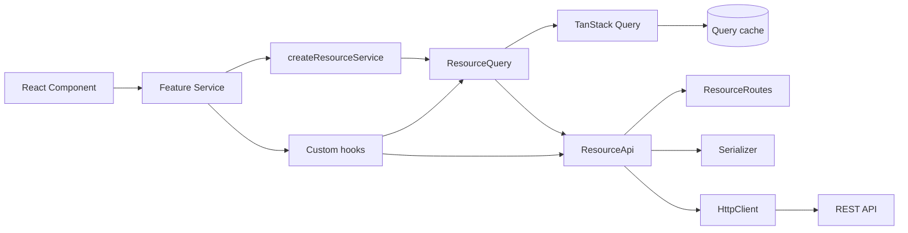
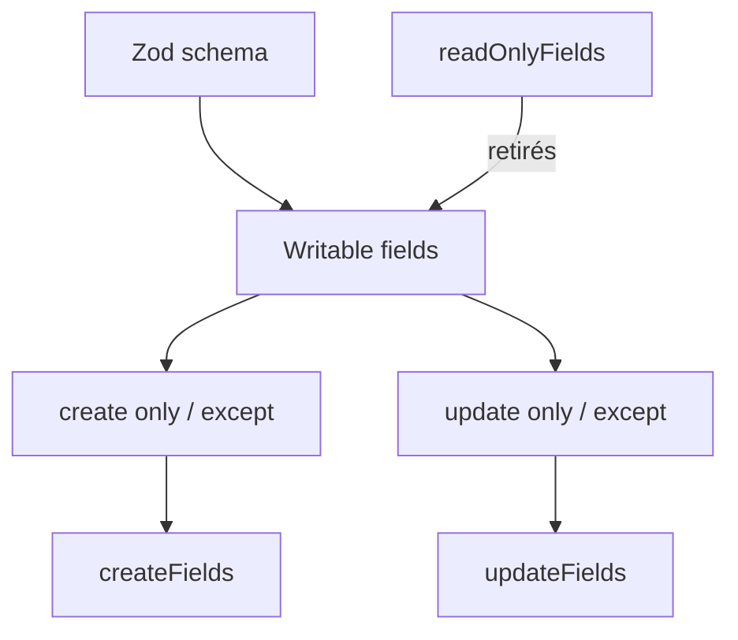
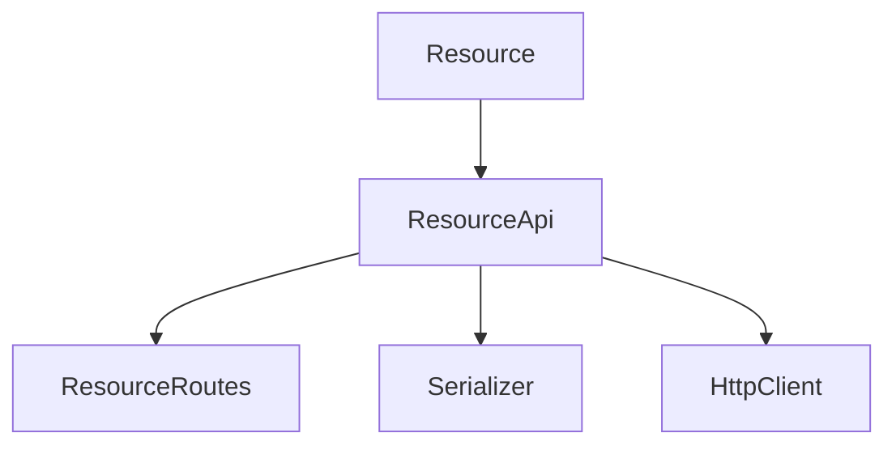
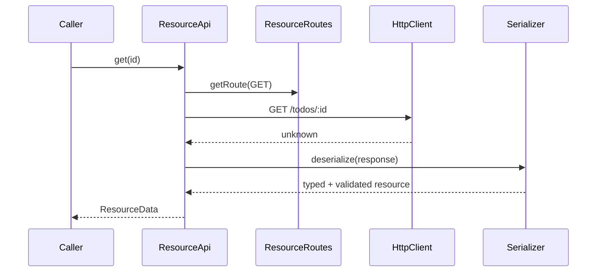
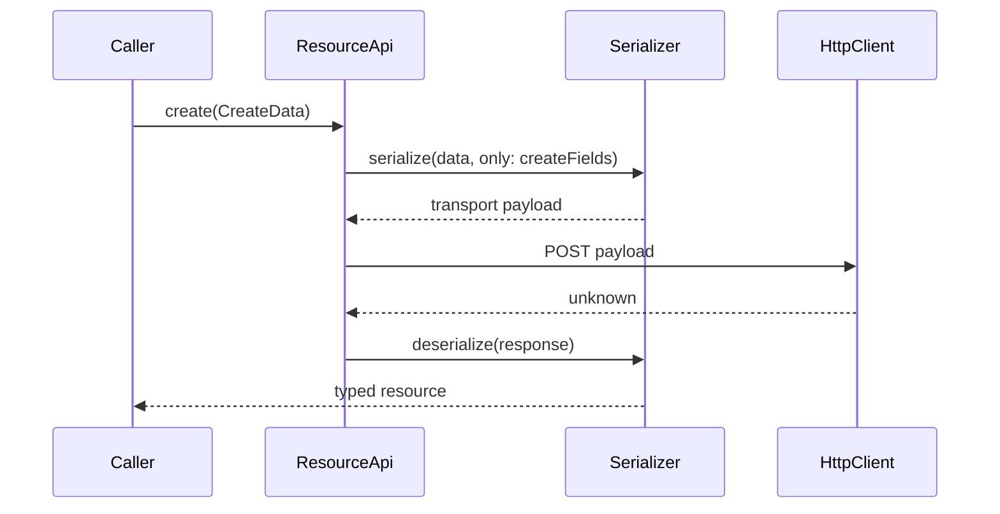

# front-template

Template interne React/TypeScript conçu pour accélérer le développement d'applications en factorisant les conventions répétitives autour des ressources, du typage, de la validation, de la sérialisation et des appels HTTP.

> **Principe directeur :** définir peu, dériver beaucoup, rester extensible.

L'objectif n'est pas de recréer un framework généraliste, mais de fournir une base cohérente dans laquelle une ressource métier définie une fois peut alimenter automatiquement une grande partie de la couche data du front.

## État du projet

La chaîne `Resource → ResourceRoutes → Serializer → ResourceApi → HttpClient` est en place et testée. La configuration, les settings, le bootstrap et les utilitaires de base sont également disponibles.

**TanStack Query est intégré** via `ResourceQuery`. Les lectures `getAll` / `get`, les mutations `create` / `update` / `delete`, les query keys, la propagation de `AbortSignal` et les règles d’invalidation du cache ont été validées contre l’API Laravel de référence et couvertes par des tests.

La couche **Service est en place** via `createResourceService()`. Elle constitue la façade React générique d’une feature : les composants utilisent par exemple `todoService.useGetAll()`, `useGet()`, `useCreate()`, `useUpdate()` et `useDelete()` sans importer directement TanStack Query, `ResourceQuery` ou `ResourceApi`.

`createResourceService()` reçoit désormais explicitement un `ResourceQuery`. Une même instance de `ResourceQuery` peut ainsi être partagée entre le CRUD générique et les opérations métier spécifiques d’une feature.

Une seconde feature de référence, **Note**, valide cette extensibilité avec l’opération métier `togglePinned`. `noteService.useTogglePinned()` appelle une méthode spécifique de `NoteApi`, puis réutilise la politique d’invalidation de `ResourceQuery` afin de rafraîchir la liste et le détail concernés.

Le typage dérivé de la `Resource` reste conservé à travers toute la chaîne jusqu’aux variables des mutations.



## Stack

- React 19
- TypeScript 6
- Vite 8
- Zod pour les schémas et la validation runtime
- Vitest + Testing Library pour les tests
- date-fns pour les dates
- deepmerge-ts pour les settings
- ESLint + Prettier
- Husky + lint-staged + commitlint
- Node.js 24 minimum (`.nvmrc` = `24`)

## Structure

```text
src/
├── core/
│   ├── api/
│   │   ├── HttpClient.ts
│   │   ├── ResourceApi.ts
│   │   └── ResourceId.ts
│   ├── bootstrap/
│   │   └── bootstrapApplication.ts
│   ├── config/
│   ├── query/
│   │   └── ResourceQuery.ts
│   ├── resource/
│   │   ├── FieldSelection.ts
│   │   ├── Resource.ts
│   │   └── ResourceData.ts
│   ├── service/
│   │   └── ResourceService.ts
│   ├── route/
│   │   ├── HttpMethod.ts
│   │   ├── ResourceRoute.ts
│   │   ├── ResourceRouteName.ts
│   │   └── Route.ts
│   ├── serializer/
│   │   └── Serializer.ts
│   ├── settings/
│   └── utils/
├── features/
│   ├── note/
│   └── todo/
└── test/
    └── setup.ts
```

`core/` contient les briques génériques du template. `features/` contient les éléments propres aux domaines métier. Les tests sont principalement colocalisés avec le code ; `src/test/` sert à l'infrastructure de test partagée.

---

# Architecture des ressources

## `Resource`

`Resource` est la source de vérité d'une ressource côté front. Elle associe un nom, un schéma Zod et les règles indiquant quels champs peuvent être écrits lors d'un create ou d'un update.

Exemple actuel :

```ts
export const todoSchema = z.object({
  id: z.number(),
  title: z.string().min(1),
  description: z.string().optional(),
  isCompleted: z.boolean().default(false),
  createdAt: z.coerce.date(),
})

export const todoResource = new Resource('todo', todoSchema, {
  readOnlyFields: ['id', 'createdAt'],
  create: {
    except: ['isCompleted'],
  },
})
```

Cela donne conceptuellement :



Pour ce `Todo` :

```text
schema fields  = id, title, description, isCompleted, createdAt
readOnlyFields = id, createdAt
writableFields = title, description, isCompleted
createFields   = title, description
updateFields   = title, description, isCompleted
```

Par défaut, tous les champs non readonly sont disponibles en create et en update.

### `only` / `except`

La sélection est représentée par `FieldSelection<TField>`. `only` et `except` sont mutuellement exclusifs au niveau TypeScript.

```ts
create: {
  only: ['title', 'description'],
}
```

ou :

```ts
create: {
  except: ['isCompleted'],
}
```

Un champ déclaré readonly ne peut pas être réintroduit via `only`. La `Resource` vérifie également ces incohérences au runtime.

## Typage dérivé : `CreateData` et `UpdateData`

`ResourceData.ts` dérive les payloads TypeScript directement de la Resource et de ses options. Il n'est donc pas nécessaire de maintenir manuellement des interfaces `CreateTodo`, `UpdateTodo`, etc.

Pour le Todo ci-dessus :

```ts
type CreateTodo = CreateData<typeof todoResource>
// {
//   title: string
//   description?: string
// }

type UpdateTodo = UpdateData<typeof todoResource>
// {
//   title?: string
//   description?: string
//   isCompleted?: boolean
// }
```

`UpdateData` est volontairement `Partial`: les updates utilisent actuellement PATCH.

La propriété phantom `$options` de `Resource` existe uniquement au niveau du système de types afin de conserver le type littéral exact des options passées au constructeur. Elle n'est pas une donnée runtime à utiliser dans le code applicatif.

### Deux niveaux de sécurité

Le template distingue volontairement :

1. **TypeScript / compile-time** : l'API haut niveau empêche les appels incorrects pendant le développement.
2. **Zod / runtime** : les données réellement reçues ou sérialisées sont validées à l'exécution.

Par exemple, `ResourceApi.create()` exige un `CreateData<...>`, tandis que `Serializer.serialize()` accepte `unknown` puis valide la donnée avec Zod. Cela permet au Serializer de rester une vraie frontière de validation sans perdre le typage de l'API publique de la Resource.

---

# Routes

## `ResourceRoutes`

`ResourceRoutes` génère les routes CRUD conventionnelles à partir du nom de la Resource.

Pour `new Resource('todo', ...)` :

| Opération | Méthode | URL          |
| --------- | ------- | ------------ |
| `getAll`  | GET     | `/todos`     |
| `get`     | GET     | `/todos/:id` |
| `create`  | POST    | `/todos`     |
| `update`  | PATCH   | `/todos/:id` |
| `delete`  | DELETE  | `/todos/:id` |

Une `baseUrl` spécifique à la ressource peut être injectée au constructeur. Cette URL représente le **chemin de ressource**, pas l'origine de l'API : l'origine (`http://...`) appartient à `HttpClient`.

La pluralisation est volontairement simple pour le moment : `${resource.name}s`.

Les noms de routes et méthodes HTTP sont centralisés dans `RESOURCE_ROUTE` et `HTTP_METHOD` afin d'éviter les chaînes dispersées.

---

# Sérialisation

## `Serializer`

`Serializer` assure la frontière entre les objets métier validés par Zod et les payloads JS transportables.

Responsabilités actuelles :

- `deserialize(data)` : valide une ressource avec Zod ;
- `deserializeMany(data)` : valide un tableau de ressources ;
- `serialize(data)` : valide puis transforme les valeurs transportables ;
- sélection de champs avec `only` / `except` ;
- sérialisation partielle avec `partial` ;
- conversion récursive des `Date` en ISO, y compris dans les objets imbriqués et tableaux.

Exemple :

```ts
serializer.serialize(
  { completed: true },
  {
    only: ['title', 'completed'],
    partial: true,
  },
)
```

`partial` est indépendant de `only` / `except` : la sélection indique **quels champs sont autorisés**, tandis que `partial` indique **si tous les champs sélectionnés sont requis**.

C'est essentiel pour PATCH :

```text
updateFields = title, description, completed
payload      = { completed: true }
partial      = true
              ↓
le payload est valide sans exiger title et description
```

Le Serializer ne connaît volontairement ni HTTP, ni create/update, ni TanStack Query.

---

# HTTP

## `HttpClient`

`HttpClient` est volontairement une couche de transport simple. Il ne connaît ni les Resources ni Zod.

Il fournit actuellement :

```ts
get(url, options)
post(url, body, options)
put(url, body, options)
patch(url, body, options)
delete (url, options)
```

Comportements actuels :

- base URL provenant de `env('API_URL')` par défaut ;
- base URL injectable, notamment pour les tests ;
- JSON stringify automatique pour les bodies ;
- `Content-Type: application/json` lorsqu'un body est présent ;
- headers personnalisés ;
- `AbortSignal` ;
- erreur simple pour une réponse HTTP non `ok` ;
- `204` → `undefined` ;
- réponse non JSON → `undefined` ;
- réponse JSON → `unknown`.

Le retour `unknown` est intentionnel : `HttpClient` transporte des données ; la validation appartient à la couche supérieure.

`AbortSignal` permettra notamment à TanStack Query de propager son signal d'annulation jusqu'à `fetch`.

---

# `ResourceApi`

`ResourceApi` assemble les briques précédentes pour fournir une API CRUD générique, typée et validée.



API publique :

```ts
getAll(options?)
get(id, options?)
create(data, options?)
update(id, data, options?)
delete(id, options?)
```

`ResourceId` accepte actuellement `string | number`. Les IDs insérés dans les URLs sont passés par `encodeURIComponent`.

Les dépendances `ResourceRoutes`, `Serializer` et `HttpClient` peuvent être injectées dans le constructeur. L'utilisation normale reste simple :

```ts
const api = new ResourceApi(todoResource)
```

mais les tests peuvent par exemple injecter un `HttpClient` contrôlé.

## Flux GET



## Flux GET ALL

```text
ResourceApi.getAll()
    ↓
ResourceRoutes.getRoute(GET_ALL)
    ↓
HttpClient.get()
    ↓ unknown
Serializer.deserializeMany()
    ↓
ResourceData[]
```

## Flux CREATE



Le compile-time empêche déjà d'envoyer des champs qui ne font pas partie de `CreateData`; la sélection runtime `createFields` constitue en plus le contrat de sérialisation.

## Flux UPDATE

```text
ResourceApi.update(id, UpdateData)
    ↓
Serializer.serialize(
    data,
    only: updateFields,
    partial: true,
)
    ↓
HttpClient.patch()
    ↓ unknown
Serializer.deserialize()
    ↓
ResourceData
```

Le `partial: true` est important : `UpdateData` autorise un PATCH avec un seul champ.

## Flux DELETE

```text
ResourceApi.delete(id)
    ↓
ResourceRoutes → DELETE /resource/:id
    ↓
HttpClient.delete()
    ↓
void
```

---

# Configuration et settings

Le projet distingue deux concepts.

## Config : dépendante de l'environnement

`core/config` gère les valeurs qui changent selon l'environnement d'exécution.

Le schéma actuel contient :

```ts
API_URL: z.url()
```

Dans Vite, la variable correspondante est :

```dotenv
VITE_API_URL=http://localhost:3000
```

`parseConfig()` :

1. conserve les variables préfixées `VITE_` ;
2. retire ce préfixe ;
3. valide le résultat avec un schéma Zod strict ;
4. produit une erreur lisible si la configuration est invalide.

`initializeConfig()` doit être appelé avant `env()`.

## Settings : conventions applicatives

`core/settings` contient les conventions versionnées avec l'application et non les valeurs propres à un environnement.

Valeurs actuelles :

```ts
date: {
  format: 'dd/MM/yyyy',
  dateTimeFormat: 'dd/MM/yyyy HH:mm',
}
```

Les overrides sont validés puis fusionnés profondément avec les valeurs par défaut via `deepmerge-ts`.

## Bootstrap

`bootstrapApplication()` initialise actuellement :

```text
bootstrapApplication()
    ├── initializeConfig()
    └── initializeSettings()
```

Il est appelé dans `main.tsx` **avant le render React** afin que les services qui dépendent de la configuration puissent être utilisés ensuite en sécurité.

---

# Utilitaires

## `DateUtils`

Classe statique utilisant `date-fns` et les settings :

- `DateUtils.format()`
- `DateUtils.formatDateTime()`
- `DateUtils.parse()`
- `DateUtils.toIso()`

Le Serializer utilise `DateUtils.toIso()` pour convertir les dates avant transport.

## `StringUtils`

Utilitaires statiques :

- `capitalize()`
- `toCamelCase()`
- `toSnakeCase()`
- `normalize()`

---

# Environnement de développement

## Installation

Le projet requiert Node.js 24 ou supérieur.

Avec nvm :

```bash
nvm use
npm install
```

Créer ensuite le fichier d'environnement local à partir de l'exemple :

```bash
cp .env.example .env
```

Puis adapter `VITE_API_URL` au backend utilisé.

Démarrage :

```bash
npm run dev
```

## Scripts npm

| Commande               | Rôle                          |
| ---------------------- | ----------------------------- |
| `npm run dev`          | serveur Vite de développement |
| `npm run build`        | typecheck puis build Vite     |
| `npm run preview`      | preview du build              |
| `npm run typecheck`    | TypeScript sans émission      |
| `npm run test`         | tests Vitest en mode run      |
| `npm run test:watch`   | Vitest en mode watch          |
| `npm run lint`         | ESLint                        |
| `npm run format`       | applique Prettier             |
| `npm run format:check` | vérifie le formatage          |

Avant de considérer un bloc de travail terminé :

```bash
npm run typecheck
npm test
npm run lint
```

## Alias `@`

`@/` pointe vers `src/`.

```ts
import { Resource } from '@/core/resource/Resource'
```

L'alias est configuré côté Vite :

```ts
resolve: {
  alias: {
    '@': path.resolve(__dirname, './src'),
  },
}
```

et côté TypeScript :

```json
{
  "paths": {
    "@/*": ["./src/*"]
  }
}
```

Pour Vitest, `setupFiles` utilise actuellement explicitement le chemin relatif :

```ts
setupFiles: './src/test/setup.ts'
```

## Formatage

Prettier :

```json
{
  "semi": false,
  "singleQuote": true,
  "trailingComma": "all",
  "tabWidth": 2,
  "printWidth": 100
}
```

`.editorconfig` impose notamment UTF-8, LF, indentation de deux espaces et newline finale.

## Git hooks

Les hooks sont gérés par Husky.

### pre-commit

```bash
npx lint-staged
```

`lint-staged` applique :

```text
*.{js,jsx,ts,tsx}
    → eslint --fix
    → prettier --write

*.{json,css,md,html}
    → prettier --write
```

Seuls les fichiers staged sont donc corrigés automatiquement avant le commit.

### commit-msg

```bash
npx --no -- commitlint --edit "$1"
```

Les messages suivent **Conventional Commits** via `@commitlint/config-conventional`.

Exemples :

```text
feat(api): add resource API
feat(serializer): support partial serialization
refactor(route): preserve resource option types
fix(config): handle invalid API URL
chore(tooling): configure commitlint
test(resource): cover readonly fields
```

Types usuels : `feat`, `fix`, `refactor`, `perf`, `test`, `docs`, `chore`, `ci`.

### pre-push

```bash
npm run typecheck
npm run test
```

Un push est donc bloqué si TypeScript ou les tests échouent. Le build complet n'est volontairement pas exécuté dans ce hook.

---

# Tests

Vitest utilise `jsdom`, avec :

```ts
test: {
  environment: 'jsdom',
  setupFiles: './src/test/setup.ts',
  globals: true,
}
```

Testing Library est disponible pour les tests React.

## Philosophie

Les tests doivent protéger les **contrats** plutôt que reproduire l'implémentation.

Exemples actuels :

- `Resource.test.ts` : comportement runtime des champs readonly/create/update ;
- `Resource.types.test.ts` : contrat compile-time de `CreateData` / `UpdateData` ;
- `Serializer.test.ts` : validation, sélection, partial, dates et tableaux ;
- `HttpClient.test.ts` : transport HTTP ;
- `ResourceApi.test.ts` : orchestration CRUD avec vraies routes et vrai Serializer, en contrôlant uniquement le transport ;
- `ResourceQuery.test.ts` : query keys, délégation des reads/mutations, politique d’invalidation du cache et contrat de `invalidateResource()` ;
- `ResourceService.test.tsx` : intégration React/TanStack de la façade CRUD ;
- `ResourceService.types.test.ts` : conservation de l’inférence des payloads create/update à travers la factory ;
- `NoteApi.test.ts` : contrat de l’opération métier `togglePinned`, endpoint spécifique, encodage de l’ID et désérialisation de la réponse ;
- `note.service.test.tsx` : intégration React de `useTogglePinned()` et réutilisation de la politique d’invalidation de `ResourceQuery` ;
- tests dédiés pour config, settings et utils.

Éviter de retester dans une feature un comportement générique déjà garanti par `core`, sauf si la feature possède un contrat spécifique à protéger.

Pour `ResourceApi`, on privilégie l'observation du comportement final plutôt que des spies sur les détails internes du Serializer : payload HTTP produit, réponse désérialisée, propagation des options, validation des réponses, etc.

---

# Frontières de responsabilité

Une règle importante du projet est de ne pas faire remonter les responsabilités d'une couche dans une autre.

```text
Resource
  définition du contrat métier et des champs

ResourceRoutes
  convention des endpoints CRUD

Serializer
  validation et transformation des données

HttpClient
  transport HTTP générique

ResourceApi
  orchestration CRUD d'une Resource

ResourceQuery / TanStack Query
  query keys, server state, cache, mutations et invalidation

ResourceService
  façade React générique exposant les hooks CRUD aux composants

Feature Service
  point d’entrée public unique d’une feature ;
  compose le CRUD générique avec les comportements métier spécifiques
```

Quelques conséquences :

- `HttpClient` ne valide pas les Resources ;
- `Serializer` ne connaît pas HTTP ;
- `ResourceRoutes` ne connaît pas l'origine de l'API ;
- `ResourceApi` ne gère pas le cache ;
- une opération métier spécifique peut étendre `ResourceApi` sans polluer le CRUD générique ;
- un Feature Service peut réutiliser le même `ResourceQuery` pour le CRUD et ses opérations métier ;
- les custom mutations ne doivent pas reconstruire manuellement les query keys lorsqu’une politique d’invalidation du core existe déjà ;
- la UI ne devrait pas reconstruire manuellement les règles déjà exprimées par une Resource.

---

# TanStack Query et `ResourceQuery`

TanStack Query est intégré au core via `ResourceQuery`. Cette couche adapte un `ResourceApi` aux primitives de TanStack Query sans déplacer la responsabilité HTTP ou de sérialisation dans le cache.

```text
React / futur Service
    ↓
ResourceQuery
    ├── queryOptions / mutationOptions
    ├── query keys
    ├── invalidation du cache
    └── ResourceApi
            ↓
        HttpClient
            ↓
         Backend
```

## Query keys

Les clés actuelles suivent une convention simple et prévisible :

```text
[resourceName]                         rootKey
[resourceName, 'list']                 listKey
[resourceName, 'detail', id]           detailKey(id)
```

Exemple pour `todo` :

```text
['todo']
['todo', 'list']
['todo', 'detail', 42]
```

Cette structure permettra plus tard d’étendre les listes avec des paramètres (pagination, filtres, query string) sans mélanger des résultats distincts dans une même entrée de cache.

## Lectures

`getAll()` et `get(id)` retournent des `queryOptions` directement utilisables avec `useQuery`. Le `AbortSignal` fourni par TanStack Query est transmis à `ResourceApi`, puis à `HttpClient` et finalement à `fetch`.

```ts
const todos = useQuery(todoQuery.getAll())
const todo = useQuery(todoQuery.get(42))
```

Flux :

```text
useQuery
   ↓
ResourceQuery.getAll() / get(id)
   ↓
ResourceApi
   ↓
HttpClient
   ↓
Backend
```

## Mutations

`ResourceQuery` expose également les options de mutation pour le CRUD. Le `QueryClient` n’est pas conservé comme état de `ResourceQuery` : il est fourni à l’opération de mutation. Cela évite de transformer le client TanStack en singleton global et facilite l’isolation des tests.

### CREATE

```text
ResourceApi.create(data)
    ↓ succès
invalidate ['resource', 'list']
```

Le type des variables est dérivé de `CreateData<Resource<...>>`; les règles `readOnlyFields` / `create` de la Resource restent donc propagées jusqu’à la mutation.

### UPDATE

```text
ResourceApi.update(id, data)
    ↓ succès
├── invalidate ['resource', 'list']
└── invalidate ['resource', 'detail', id]
```

La mutation reçoit conceptuellement :

```ts
{
  id: 42,
  data: {
    title: 'Updated title',
  },
}
```

Le payload `data` conserve le type `UpdateData<Resource<...>>`.

### DELETE

```text
ResourceApi.delete(id)
    ↓ succès
├── invalidate ['resource', 'list']
└── remove ['resource', 'detail', id]
```

Le détail est supprimé du cache plutôt que simplement invalidé : après un DELETE réussi, la ressource est connue comme inexistante et un refetch du détail provoquerait inutilement une réponse 404.

## Politique d’invalidation V1

| Mutation | Liste      | Détail concerné |
| -------- | ---------- | --------------- |
| create   | invalidate | —               |
| update   | invalidate | invalidate      |
| delete   | invalidate | remove          |

Les relations entre ressources, agrégats et invalidations via socket sont volontairement différés. La politique standard devra rester extensible lorsqu’un cas réel l’exigera.

### Invalidation réutilisable

`ResourceQuery` expose également :

```ts
invalidateResource(queryClient, id)
```

Cette méthode centralise la politique standard d’invalidation d’une ressource existante :

```text
invalidateResource(queryClient, id)
    ├── invalidate [resourceName, 'list']
    └── invalidate [resourceName, 'detail', id]
```

Elle est utilisée par la mutation générique `update`, mais peut également être réutilisée par les opérations métier spécifiques d’une feature.

L’objectif est d’éviter qu’un service métier reconstruise lui-même les query keys ou duplique les conventions de cache du core.

## Validation réelle

Le flux a été validé contre l’API Laravel de référence : chargement de liste, chargement d’un record, création, modification et suppression. Les invalidations provoquent les refetch attendus sans état local manuel (`setTodos`, `useEffect`, etc.).

## Service et façade de feature

`createResourceService()` adapte un `ResourceQuery` aux hooks React et fournit la façade CRUD générique destinée aux composants.

Il s’agit volontairement d’une **factory fonctionnelle**, et non d’une classe : les hooks React doivent être appelés depuis des fonctions/hooks conformes aux Rules of Hooks.

```text
Component
    ↓
Feature Service
    ↓
createResourceService()
    ↓
ResourceQuery
    ↓
ResourceApi
    ↓
HttpClient
    ↓
Backend
```

### Construction d'un service CRUD

Pour une feature CRUD standard :

```ts
const todoApi = new ResourceApi(todoResource)
const todoQuery = new ResourceQuery(todoApi)

export const todoService = createResourceService(todoQuery)
```

Le `ResourceQuery` est construit explicitement au niveau de la feature puis injecté dans `createResourceService()`.

Le composant ne connaît ensuite que la façade de la feature :

```ts
const todos = todoService.useGetAll()
const todo = todoService.useGet(1)

const createTodo = todoService.useCreate()
const updateTodo = todoService.useUpdate()
const deleteTodo = todoService.useDelete()
```

Il n’importe directement ni `useQuery`, ni `useMutation`, ni `useQueryClient`, ni `ResourceQuery`, ni `ResourceApi`.

Le service constitue donc le point d’entrée public de la feature côté composant.

### Conservation du typage

La factory conserve l’inférence construite depuis la `Resource` :

```text
Resource
   ↓
CreateData / UpdateData
   ↓
ResourceApi
   ↓
ResourceQuery
   ↓
createResourceService()
   ↓
useCreate() / useUpdate()
   ↓
mutate(...)
```

Un champ readonly tel que `id` reste donc interdit dans le payload d’un create ou dans `data` d’un update. Ce contrat est protégé par des tests de types dédiés couvrant toute cette chaîne.

### Extension métier

Une feature peut enrichir le CRUD générique avec ses propres opérations tout en conservant **une façade unique pour le composant**.

La feature `Note` fournit le premier cas réel avec `togglePinned`.

Conceptuellement :

```ts
const noteApi = new NoteApi(noteResource)
const noteQuery = new ResourceQuery(noteApi)

const resourceService = createResourceService(noteQuery)

function useTogglePinned() {
  const queryClient = useQueryClient()

  return useMutation({
    mutationFn: (id: ResourceId) => noteApi.togglePinned(id),

    onSuccess: async (_, id) => {
      await noteQuery.invalidateResource(queryClient, id)
    },
  })
}

export const noteService = {
  ...resourceService,
  useTogglePinned,
}
```

Le composant reste indépendant de cette plomberie :

```ts
const notes = noteService.useGetAll()
const togglePinned = noteService.useTogglePinned()

togglePinned.mutate(noteId)
```

Le flux devient :

```text
Component
    ↓
noteService.useTogglePinned()
    ↓
NoteApi.togglePinned(id)
    ↓
POST /notes/:id/toggle-pinned
    ↓
ResourceQuery.invalidateResource(id)
    ├── invalidate list
    └── invalidate detail(id)
```

Cette organisation maintient les responsabilités séparées :

- `NoteApi` connaît l’appel HTTP spécifique ;
- `ResourceQuery` connaît les query keys et la politique de cache ;
- `noteService` compose les briques et expose l’opération à React ;
- le composant ne connaît que `noteService`.

Les custom mutations ne sont volontairement **pas encore généralisées dans le core**. Un seul cas réel ne justifie pas encore une abstraction supplémentaire. Une factory ou un helper dédié pourra être introduit si plusieurs features font émerger le même pattern.

---

# Roadmap

État actuel :

```text
Resource                  ✓
ResourceRoutes            ✓
Config                    ✓
Settings + Bootstrap      ✓
Utils                     ✓
Serializer                ✓
HttpClient                ✓
API backend de référence  ✓
ResourceApi               ✓
TanStack Query            ✓
ResourceQuery             ✓
ResourceService                ✓
CRUD via feature service       ✓
Custom feature operation       ✓
Shared cache invalidation      ✓
Second resource integration    ✓
Cache abstraction              → seulement si utile
Errors                         → à concevoir
Factory / génération           → plus tard
Stabilisation V1               → après seconde feature métier significative
Logs                      → futur
Authentication            → futur
Notifications             → futur
UI                        → futur
```

## Points volontairement différés

Plusieurs sujets sont identifiés mais ne doivent pas être implémentés prématurément :

- hiérarchie d'erreurs custom (`ApiError`, erreurs de configuration/sérialisation, etc.) ;
- auth/interceptors ;
- retry HTTP ;
- réponses texte/blob ;
- logger ;
- abstraction de cache ;
- options supplémentaires du Serializer ;
- helpers éventuels de schéma (`pick` / `omit`) ;
- conventions de mapping/casing entre backend et front ;
- pluralisation avancée des routes.

Le principe reste : **introduire une abstraction lorsqu'un besoin réel apparaît dans l'intégration, pas avant.**

---

# Backend de référence

Le template est développé avec une petite API REST Laravel servant de backend de référence/test. Elle permet de tester la couche front contre un vrai serveur sans faire dépendre le framework d'une architecture backend particulière.

Le core doit rester **backend-agnostic** : les conventions spécifiques à Laravel ne doivent pas remonter dans `Resource`, `Serializer`, `HttpClient` ou `ResourceApi`.

Un point d'attention actuel est le contrat Todo : le front utilise notamment `isCompleted` / `createdAt`, tandis que le backend de référence peut utiliser des conventions différentes telles que `completed` / `created_at`. Le core n'effectue actuellement **aucune conversion automatique de casing**. Le contrat devra être aligné ou une stratégie explicite devra être introduite lors de l'intégration réelle.

---

# Principes de contribution

Lors d'une évolution du template :

1. identifier la couche réellement responsable du besoin ;
2. privilégier une modification locale plutôt qu'une abstraction transversale prématurée ;
3. conserver le typage strict au niveau des API publiques ;
4. valider au runtime les données provenant de frontières externes ;
5. ajouter ou adapter les tests du contrat concerné ;
6. exécuter `typecheck`, tests et lint ;
7. faire un commit Conventional Commit ciblé ;
8. noter les abstractions potentielles plutôt que de les construire sans cas d'usage réel.

Le template doit rester rapide à comprendre et à utiliser : la réutilisabilité n'a de valeur que si elle réduit réellement le code et la charge cognitive des features.
